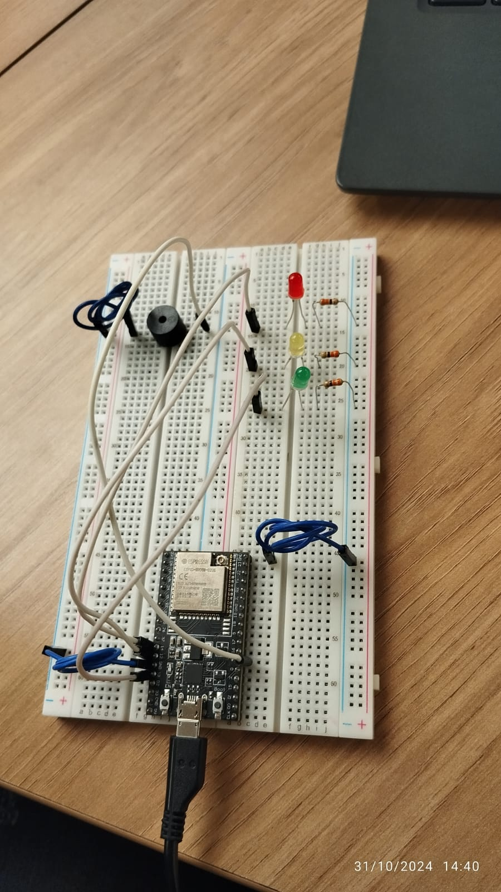

# PonderadaSem03_semaforo

## Foto montagem física:

## Vídeo funcionamento
* Acessar [aqui](https://youtube.com/shorts/ctN3ZY-xcnA?feature=share)

## Lista de materiais utilizados

- 7 jumpers macho-macho;
- 1 LED 5mm vermelho;
- 1 LED 5mm amarelo;
- 1 LED 5mm verde;
- 1 buzzer;
- 1 resistor de 5,6 ohms;
- 2 resistores de 330 ohms;
- 1 ESP32;
- 1 Protoboard;

## Relatório de montagem e conexões

&nbsp;&nbsp;&nbsp;&nbsp;Para a montagem desse protótipo, foram feitas as seguintes conexões:
##### LEDS:
###### LED vermelho:
- Resistor 330 ohms ligando o terminal negativo do LED ao GND;
- Jumper macho-macho conectando o terminal positivo do LED à porta 14 do ESP32.

###### LED Amarelo:
- Resistor 5,6 ohms ligando o terminal negativo do LED ao GND (aqui, foi usado um resistor de baixa resistência porque com resistências mais altas a luz focava muito fraca);
- Jumper macho-macho conectando o terminal positivo do LED à porta 12 do ESP32.

###### LED verde:
- Resistor 330 ohms ligando o terminal negativo do LED ao GND;
- Jumper macho-macho conectando o terminal positivo do LED à porta 13 do ESP32.

##### Buzzer:
- Jumper conectando o polo positivo à porta 4 do ESP32;
- Jumper conectando o polo negativo ao GND;

* O código para funcionamento do protótipo pode ser encontrado em <code>semaforo.ino</code>

## Tabela de Avaliação entre Pares

#### Avaliador: Ana Beatriz Passos Beggiato
##### Avaliado: Igor P. Sguissardi de Oliveira

|Critério|	Contempla (Pontos)|	Contempla Parcialmente (Pontos)	|Não Contempla (Pontos)	|Observações do Avaliador|
|-|-|-|-|-|
|Montagem física com cores corretas, boa disposição dos fios e uso adequado de resistores	|Até 3	|Até 1,5	|0 | O protótipo apresenta montagem organizada, seguindo o padrão de cores para os jumpers, mantendo boa disposição dos fios e utilizando os resistores adequadamente. **Nota 3**|	
|Temporização adequada conforme tempos medidos com auxílio de algum instrumento externo	|Até 3	|Até 1,5	|0 | Utilizando o cronometro do celular, pude avaliar que os tempos apresentados no protótipo seguem adequadamente as orientações fornecidas na descrição da atividade. **Nota 3**|	
|Código implementa corretamente as fases do semáforo e estrutura do código (variáveis representativas e comentários) |	Até 3|	Até 1,5 |	0 | O código apresentado foi bem estrturado, apresentando a implementação correta das fases do semáforo, a declaração de variáveis significativas ao contexto e apresentaçãod e comentários explicativos. **Nota 3**|	
|Ir além: Implementou um componente de extra, fez com millis() ao invés do delay() e/ou usou ponteiros no código |	Até 1 |	Até 0,5 |	0 | Não implementou nenhuma das opçoes sugeridas para ir além. **Nota 0** |	
| | | | |Pontuação Total: **9**|

#### Avaliador: Igor P. Sguissardi de Oliveira
##### Avaliado: Ana Beatriz Passos Beggiato

|Critério|	Contempla (Pontos)|	Contempla Parcialmente (Pontos)	|Não Contempla (Pontos)	|Observações do Avaliador|
|-|-|-|-|-|
|Montagem física com cores corretas, boa disposição dos fios e uso adequado de resistores	|Até 3	|Até 1,5	|0 | 3|	
|Temporização adequada conforme tempos medidos com auxílio de algum instrumento externo	|Até 3	|Até 1,5	|0 |3 |	
|Código implementa corretamente as fases do semáforo e estrutura do código (variáveis representativas e comentários) |	Até 3|	Até 1,5 |	0 | 3|	
|Ir além: Implementou um componente de extra, fez com millis() ao invés do delay() e/ou usou ponteiros no código |	Até 1 |	Até 0,5 |	0 |1 |	
| | | | |Pontuação Total **10**|